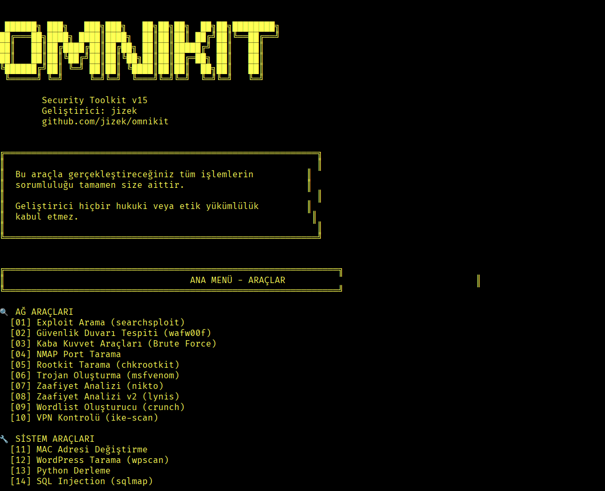

<div align="center">

# ??? OMNIKIT Security Toolkit


### *The Ultimate Cybersecurity Arsenal*

[](https://www.python.org/)
[](LICENSE)
[](https://github.com/jizek/omnikit)
[](https://github.com/jizek/omnikit/releases)
[](https://github.com/jizek/omnikit)

**[???? English](#english)** | **[???? T�rk�e](#turkish)**

---

</div>

## ?? Highlights

```ascii
-==========================================================�
�                                                          �
�   ------� ---�   ---�---�   --�--�--�  --�--�--------�   �
�  ---===--�----� ----�----�  --�--�--� ------�L==---==-   �
�  --�   --�----------�-----� --�--�------- --�   --�      �
�  --�   --�--�L------�--�L--�--�--�---=--� --�   --�      �
�  L----------� L=- --�--� L----�--�--�  --�--�   --�      �
�   L=====- L=-     L=-L=-  L===-L=-L=-  L=-L=-   L=-      �
�                                                          �
�              Security Toolkit v15                        �
�              54+ Professional Tools                      �
�                                                          �
L==========================================================-
```

<div align="center">

### ?? **54+ Tools** | ?? **8 ASCII Designs** | ?? **Multi-Language** | ?? **Cross-Platform**

**A comprehensive security testing framework combining network analysis, web security, cryptography, and advanced penetration testing capabilities in one unified platform.**

</div>

---

## ?? Interface Preview / Aray�z �nizleme

<div align="center">



*Omnikit's intuitive terminal interface with 54+ security tools / Omnikit'in 54+ g�venlik arac� i�eren sezgisel terminal aray�z�*

</div>

---

<a name="turkish"></a>

## ???? T�rk�e

### ?? Nedir?

**Omnikit**, siber g�venlik profesyonelleri, penetrasyon test�ileri ve g�venlik ara�t�rmac�lar� i�in geli�tirilmi� **kapsaml�** ve **g��l�** bir ara� setidir. 54'ten fazla g�venlik arac�n� tek bir platformda birle�tirerek, g�venlik testlerini **h�zl�**, **verimli** ve **profesyonel** hale getirir.

### ?? Yasal Uyar�

> **�NEML�:** Bu ara� yaln�zca **e�itim**, **��retim** ve **yasal penetrasyon testleri** i�in geli�tirilmi�tir. Bu ara�la ger�ekle�tirece�iniz t�m i�lemlerin **sorumlulu�u tamamen size aittir**. Geli�tirici hi�bir hukuki veya etik y�k�ml�l�k kabul etmez.

### ? �zellikler

<table>
<tr>
<td width="50%">

#### ?? A� G�venli�i
- Port Tarama & Servis Tespiti
- G�venlik Duvar� Analizi
- VPN & Proxy Kontrol�
- DNS Analizi & Y�nlendirme
- WiFi G�venlik Testleri
- Paket Dinleme & Analiz

</td>
<td width="50%">

#### ?? Web G�venli�i
- SQL Injection Testleri
- XSS Zafiyet Tarama
- Admin Panel Bulma
- WordPress G�venlik Analizi
- Directory Fuzzing
- SSL/TLS Analizi

</td>
</tr>
<tr>
<td width="50%">

#### ?? Kriptografi
- Hash �ifreleme (MD5, SHA, Blake2b)
- �ifre K�rma & Analiz
- Base64 Encode/Decode
- Steganografi
- �zel �ifreleme Algoritmalar�
- Dosya Hash Analizi

</td>
<td width="50%">

#### ?? Brute Force
- SSH/FTP/Telnet Brute Force
- HTTP/HTTPS Brute Force
- SMB/RDP/VNC Brute Force
- Mail Servisleri Brute Force
- Zip �ifre K�rma
- Wordlist Olu�turma

</td>
</tr>
<tr>
<td width="50%">

#### ?? Payload Olu�turma
- Msfvenom Otomasyonu
- Trojan Olu�turma
- Reverse Shell Payloads
- Android Payloads
- Raspberry Pi Pico Payloads
- ESP32/ESP8266 Payloads

</td>
<td width="50%">

#### ?? Forensics & Analiz
- Dosya Analizi
- EXIF ��lemleri
- PDF Bilgi Toplama
- Email Header Analizi
- Binary Analiz (Strings)
- Timestamp Manip�lasyonu

</td>
</tr>
</table>

### ? H�zl� Ba�lang��

#### ?? Kurulum

```bash
# Depoyu klonlay�n
git clone https://github.com/jizek/omnikit.git

# Dizine girin
cd omnikit

# Gerekli paketleri y�kleyin
pip install -r requirements.txt

# Program� ba�lat�n (Ana dizinden �al��t�r�n)
python3 main.py
```

> **?? Not:** Art�k hangi dizinde olursan�z olun, `python3 main.py` komutu ile Omnikit'i sorunsuz ba�latabilirsiniz. Dosya yolu hatalar� otomatik olarak ��z�l�r.

#### ?? Docker ile Kullan�m

```bash
# Docker image'� �ekin
docker pull jizek/omnikit:latest

# Container'� �al��t�r�n
docker run -it jizek/omnikit:latest
```

### ?? Gereksinimler

- **Python:** 3.6 veya �zeri
- **��letim Sistemi:** Linux (�nerilen), Windows, macOS
- **Yetki:** Baz� ara�lar i�in root/administrator

### ?? Kullan�m

1. **Ba�latma:** `python3 main.py` (Ana dizinden �al��t�r�n)
2. **Ara� Se�imi:** Ana men�den istedi�iniz arac� se�in (1-54)
3. **Parametre Giri�i:** Gerekli bilgileri girin
4. **Sonu�:** Analiz sonu�lar�n� g�r�nt�leyin

> **? H�zl� �pucu:** Omnikit ana dizininde oldu�unuzdan emin olun. `main.py` dosyas� t�m yol sorunlar�n� otomatik ��zecektir.

### ? Proje Yap�s�

```
omnikit/
+�� ?? main.py                 # ?? ANA G�R�� NOKTASI (Buradan ba�lat�n!)
+�� ?? surum.txt               # Versiyon bilgisi
-
+�� ?? src/                    # Ana kaynak kodlar
-   +�� omnikittoolsv15.py    # Ana program
-   L�� acilis.py             # Banner & Logo
-
+�� ?? tools/                  # Ara� mod�lleri
-   +�� kits/                 # 35+ yard�mc� ara�
-   +�� blue-cough/           # DDoS ara�lar�
-   +�� crawler-x11/          # Web crawler
-   +�� imitator-x11/         # AI imitator
-   +�� oltalama/             # Phishing ara�lar�
-   +�� password-kits/        # �ifre ara�lar�
-   +�� pico-payloads/        # RPi Pico payloads
-   +�� omnikit-twin/         # ESP32/ESP8266
-   L�� vrs/                  # Payload generator
-
+�� ?? assets/                 # G�rseller & medya
-   L�� omnikit.png           # Logo
-
+�� ?? docs/                   # Dok�mantasyon
-   +�� SECURITY.md           # G�venlik politikas�
-   L�� LOGO_INFO.md          # Logo bilgileri
-
+�� ? .github/                # GitHub yap�land�rmas�
-   L�� workflows/            # CI/CD
-
+�� ?? README.md               # Bu dosya
+�� ?? LICENSE                 # MIT Lisans�
+�� ?? requirements.txt        # Python ba��ml�l�klar�
L�� ?? Dockerfile              # Docker yap�land�rmas�
```

> **?? �nemli:** `main.py` dosyas� proje k�k dizininde bulunur ve t�m dosya yollar�n� otomatik olarak y�netir. Art�k `FileNotFoundError` hatas� almayacaks�n�z!

### ??? Ara� Kategorileri

<details>
<summary><b>?? A� G�venli�i Ara�lar� (10 Ara�)</b></summary>

1. **Exploit Arama** - searchsploit otomasyonu ile zafiyet veritaban� tarama
2. **G�venlik Duvar� Tespiti** - wafw00f ile WAF/IDS/IPS tespiti
3. **Kaba Kuvvet Sald�r�lar�** - Multi-protocol brute force (SSH, FTP, HTTP, RDP)
4. **NMAP Port Tarama** - Geli�mi� port tarama ve servis tespiti
5. **Rootkit Tarama** - chkrootkit ile sistem g�venlik analizi
6. **Trojan Olu�turma** - msfvenom otomasyonu ile payload �retimi
7. **Web Zafiyet Analizi** - nikto ile web sunucu g�venlik taramas�
8. **Sistem Zafiyet Analizi** - lynis ile kapsaml� sistem denetimi
9. **Wordlist Olu�turucu** - crunch ile �zel wordlist �retimi
10. **VPN G�venlik Kontrol�** - ike-scan ile VPN yap�land�rma analizi

</details>

<details>
<summary><b>?? Sistem G�venli�i Ara�lar� (4 Ara�)</b></summary>

11. **MAC Adresi De�i�tirme** - macchanger ile a� kimli�i y�netimi
12. **WordPress G�venlik Tarama** - wpscan ile WordPress zafiyet analizi
13. **Python Kod Derleme** - py_compile ile kaynak kod korumas�
14. **SQL Injection Testi** - sqlmap ile veritaban� g�venlik analizi

</details>

<details>
<summary><b>?? Geli�mi� G�venlik Ara�lar� (40+ Ara�)</b></summary>

#### Kriptografi & �ifreleme
- Hash �ifreleme (MD5, SHA-256, Blake2b)
- �ifre k�rma ve analiz ara�lar�
- Base64 encode/decode i�lemleri
- Steganografi ara�lar�
- �zel �ifreleme algoritmalar�

#### Web G�venlik Testleri
- SQL Injection test ara�lar�
- XSS zafiyet taray�c�
- Admin panel bulucu
- Directory fuzzing
- SSL/TLS g�venlik analizi
- Web scraping ara�lar�

#### A� Analizi
- Port taray�c�
- DNS analiz ara�lar�
- Subdomain ke�if
- Traceroute analizi
- Paket dinleme (sniffing)
- Anormal DNS tespiti

#### Forensics & Analiz
- Dosya analizi ara�lar�
- EXIF veri i�leme
- PDF bilgi toplama
- Email header analizi
- Binary analiz (strings)
- Timestamp manip�lasyonu
- Hash bulucu

#### Sosyal M�hendislik
- Phishing sayfa olu�turma
- Sahte login sayfalar�
- Bilgi toplama ara�lar�

#### Otomasyon Ara�lar�
- Instagram bot
- Spam bot
- Auto clicker
- Hesap bulucu ara�lar�

#### IoT & Embedded
- Raspberry Pi Pico payloads
- ESP32/ESP8266 ara�lar�
- Omnikit-Twin (IoT g�venlik)

</details>


### ?? �zellikler

- ? **8 Farkl� ASCII Art** - Her �al��t�rmada farkl� tasar�m
- ?? **�oklu Dil Deste�i** - T�rk�e & �ngilizce
- ?? **Cross-Platform** - Windows, Linux, macOS
- ?? **Kullan�c� Dostu** - Kolay men� navigasyonu
- ?? **Ana Men�ye D�n** - Her ara�ta geri d�n��
- ?? **Renkli Aray�z** - Terminal renklendirmesi
- ?? **Otomatik Kurulum** - Eksik paketleri otomatik y�kler
- ?? **Docker Deste�i** - Containerized deployment
- ?? **G�venli Kullan�m** - E�itim ve yasal test ama�l�

---

## ?? Katk�da Bulunma

Katk�lar�n�z� bekliyoruz! L�tfen �u ad�mlar� izleyin:

1. Projeyi fork edin
2. Feature branch olu�turun (`git checkout -b feature/YeniOzellik`)
3. De�i�ikliklerinizi commit edin (`git commit -m 'Yeni �zellik eklendi'`)
4. Branch'inizi push edin (`git push origin feature/YeniOzellik`)
5. Pull Request olu�turun

Detayl� bilgi i�in [CONTRIBUTING.md](CONTRIBUTING.md) dosyas�na bak�n.

---

<a name="english"></a>

## ???? English

### ?? What is Omnikit?

**Omnikit** is a **comprehensive** and **powerful** toolkit designed for cybersecurity professionals, penetration testers, and security researchers. It combines **54+ security tools** into a single platform, making security testing **fast**, **efficient**, and **professional**.

### ?? Legal Disclaimer

> **IMPORTANT:** This tool is developed solely for **educational**, **instructional**, and **legal penetration testing** purposes. You are entirely responsible for all actions performed with this tool. The developer accepts no legal or ethical liability.

### ? Features

- ?? **Network Security** - Port scanning, firewall analysis, VPN checking
- ?? **Web Security** - SQL injection, XSS, admin panel finder
- ?? **Cryptography** - Hash encryption, password cracking, steganography
- ?? **Brute Force** - Multi-protocol brute forcing tools
- ?? **Payload Generation** - Msfvenom automation, trojan creation
- ?? **Forensics** - File analysis, EXIF operations, hash analysis
- ?? **Social Engineering** - Phishing tools, information gathering
- ?? **Automation** - Bot frameworks and automated testing tools
- ?? **8 ASCII Art Designs** - Random design on each launch
- ?? **Multi-Language** - Turkish & English support
- ?? **Cross-Platform** - Windows, Linux, macOS compatible
- ?? **Docker Support** - Containerized deployment ready

### ? Quick Start

```bash
# Clone the repository
git clone https://github.com/jizek/omnikit.git

# Navigate to directory
cd omnikit

# Install requirements
pip install -r requirements.txt

# Run the tool (from main directory)
python3 main.py
```

> **?? Note:** Now you can run Omnikit from anywhere with `python3 main.py`. File path errors are automatically resolved.

### ?? Requirements

- **Python:** 3.6 or higher
- **OS:** Linux (recommended), Windows, macOS
- **Privileges:** Root/Administrator for some tools

### ?? Usage

1. **Start:** `python3 main.py` (Run from main directory)
2. **Select Tool:** Choose from main menu (1-54)
3. **Enter Parameters:** Provide required information
4. **View Results:** Analyze the output

> **? Quick Tip:** Make sure you're in the Omnikit main directory. The `main.py` file will automatically resolve all path issues.

### ?? Contributing

Contributions are welcome! Please follow these steps:

1. Fork the project
2. Create feature branch (`git checkout -b feature/NewFeature`)
3. Commit changes (`git commit -m 'Add new feature'`)
4. Push to branch (`git push origin feature/NewFeature`)
5. Create Pull Request

See [CONTRIBUTING.md](CONTRIBUTING.md) for detailed guidelines.

### ?? License

This project is licensed under the [MIT License](LICENSE).

### ? Star Us!

If you like this project, please give it a ? to show your support!

---

<div align="center">

### ?? Made with ?? for the Security Community

**[? Back to Top](#-omnikit-security-toolkit)**

</div>

